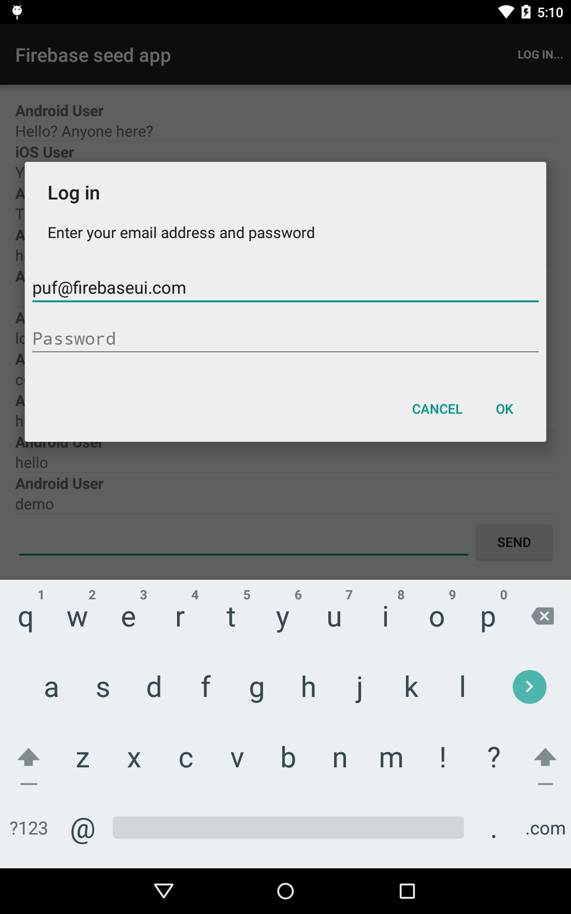
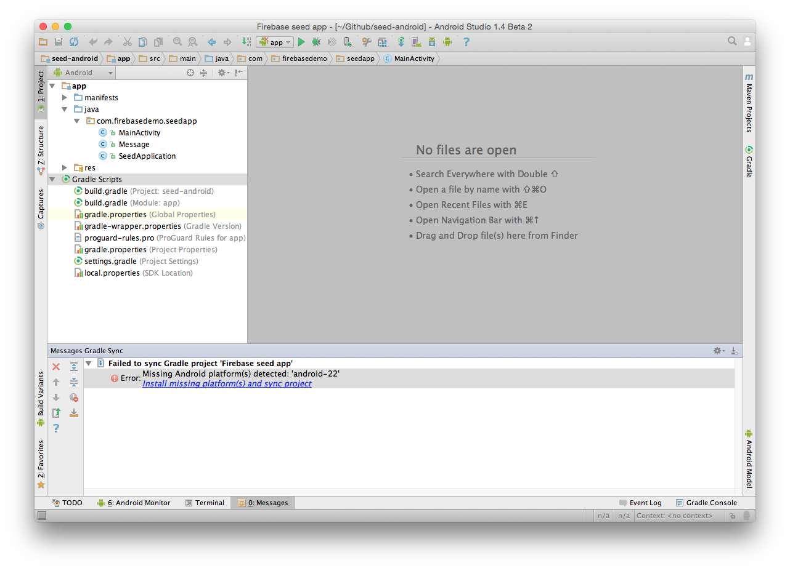
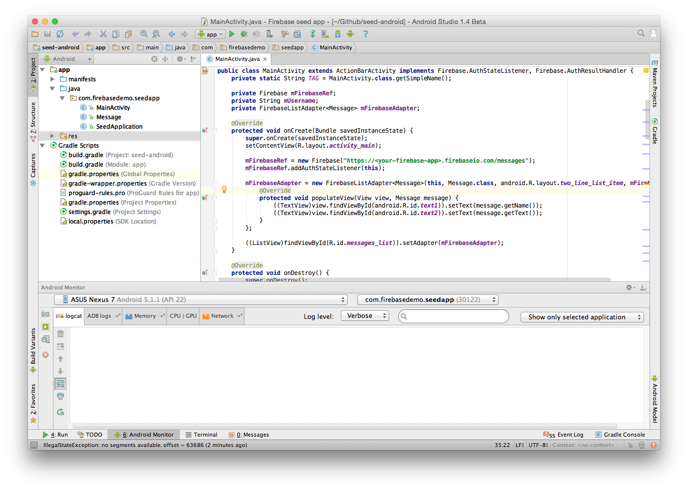

android + Firebase Seed App
=========================

This is a seed application to help you get started building apps with [Android](https://www.android.com/) and Firebase.
Using [FirebaseUI-Android](https://github.com/firebase/FirebaseUI-Android/) this app implements a `ListView` of messages (automatically synchronized with the data in
the Firebase database), log in with email and password and the ability to add new messages.



## Getting Started

> For a general introduction, see the documentation on [programming Android apps using Firebase](https://www.firebase.com/docs/android/).

Clone this repo to your local machine:

```
git clone git@github.com:firebase/seed-android.git
```

Open the directory in Android Studio.

If you are missing any build tools, SDKs or other dependencies, Android Studio will tell you about it.



Accept all its suggestions and your Android Studio should look like this:



Open `app/java/com.firebasedemo.seedap/MainActivity.java` and change line 31 to point to your own Firebase Database.

## Running your app

Run the seed app by clicking the "Run 'app'" button in the toolbar (or by pressing ctrl-R on the keyboard).

You can run the app in physical Android device or in an emulator that runs on your machine.
The app will run on Android Gingerbread (2.3.3, API level 10) or up.


## How it Works

> If you want to learn how to build this application from scratch yourself, take our [FirebaseUI for Android codelab](https://github.com/firebase/FirebaseUI-Android/tree/master/codelabs/chat).

This app is built using FirebaseUI for Android, which in turn is built on top of the Firebase SDK for Android.

It uses a `FirebaseListAdapter` to adapt messages in the Firebase Database to a `ListView` in the app.

The app uses the Firebase SDK for Android to create a reference to the Firebase Database and to send new message to the database.

### Email & password authentication

This app makes use of Firebase's [email & password authentication](https://www.firebase.com/docs/web/guide/login/password.html).
To enable email & password auth, navigate to the "Login & Auth" tab in your Firebase app dashboard and select "Enable Email & Password Authentication".

Once it's enabled, you're ready to start creating and authenticating users in your app.
The app creates users with `Firebase.createUser()` method from the Firebase SDK for Android, passing it an email and password.
It uses `Firebase.authWithPassword()` to log users in, and `Firebase.unauth()` to log users out.
This app also makes use of `Firebase.AuthStateListener` to check the user's authentication state and set `mUserName` to the current user.

Firebase also supports authentication with Facebook, Twitter, GitHub, Google, anonymous auth, and custom authentication. Check out the docs on user authentication for details on these authentication methods.

Adding messages to a synchronized array

This app uses the `FirebaseListAdapter` from the FirebaseUI library for Android to synchronize message data from the Firebase database to our app.
Using `FirebaseListAdapter`, our local `ListView` is kept in sync with our remote Firebase data.
To add items to the database, the app uses `Firebase.push()` and `Firebase.setValue()`.
Check out the Firebase for Android documentation for more details on how this works.

## Testing your app

## Securing your app

## Deploying your app

## Debugging your app

## Repo Structure

## Next Steps

### Community

Firebase has an active developer community consisting of over 230,000 developers. There are a number of different channels for contributing to our community, including:

1. [Stack Overflow](http://www.stackoverflow.com/tags/firebase)
1. [Firebase Talk Google Group](https://groups.google.com/forum/#!forum/firebase-talk)
1. [Twitter](https://twitter.com/firebase)
1. [Facebook](https://www.facebook.com/Firebase)
1. [Google+](http://plus.google.com/115330003035930967645)

Additional information on the community, help, or support can be found on our [help page](https://www.firebase.com/docs/help/).

### Contributing

We'd love to accept your sample apps and patches! Before we can take them, we a few business items to take care of including our CLA and an overview of our contribution process. Please view [CONTRIBUTING.md](https://github.com/firebase/seed-android/blob/master/CONTRIBUTING.md) for more information.

1. Submit an issue describing your proposed change to the repo in question.
1. The repo owner will respond to your issue promptly.
1. If your proposed change is accepted, and you haven't already done so, sign a
   Contributor License Agreement (see details above).
1. Fork the desired repo, develop and test your code changes.
1. Ensure that your code adheres to the existing style of the library to which
   you are contributing.
1. Ensure that your code has an appropriate set of unit tests which all pass.
1. Submit a pull request.
